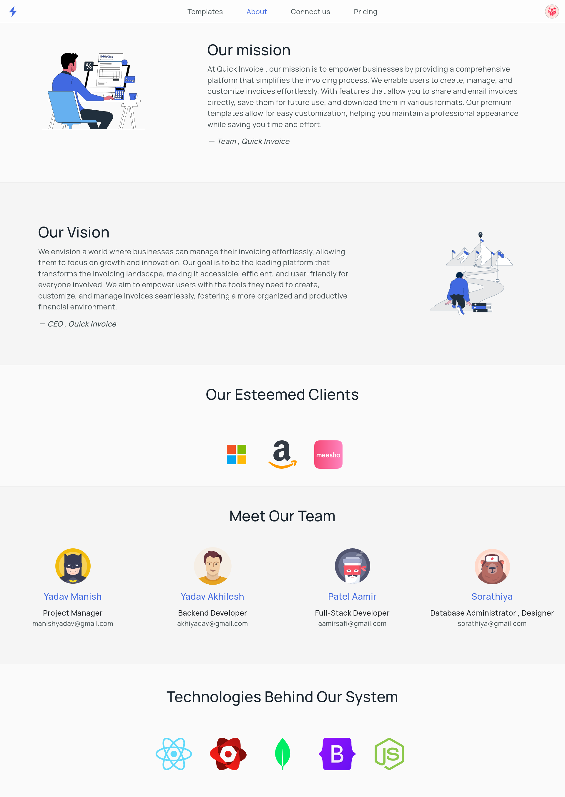
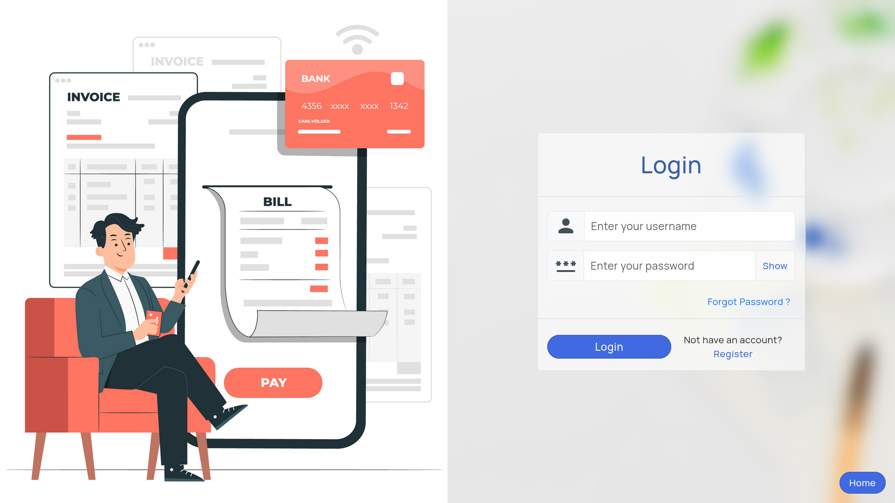
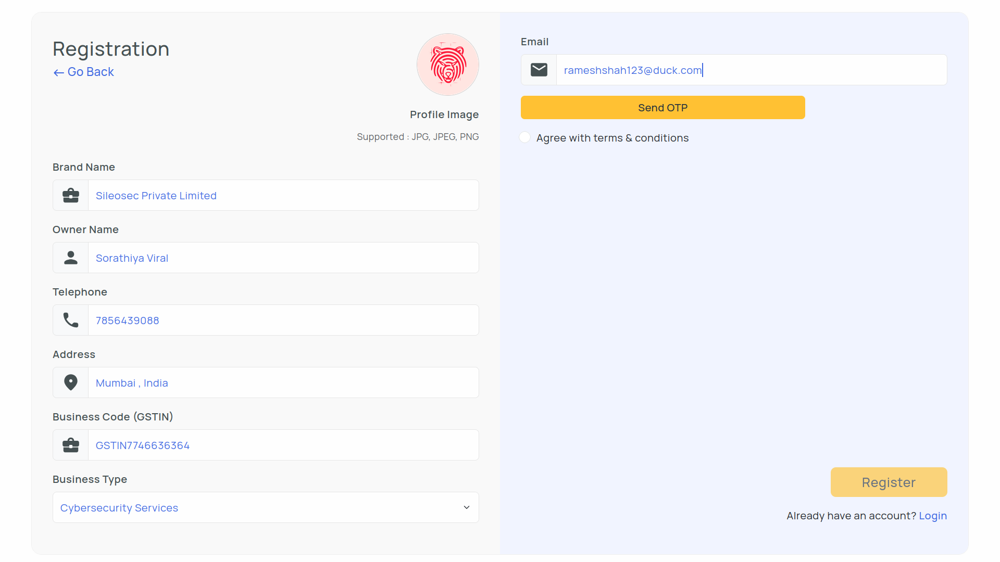
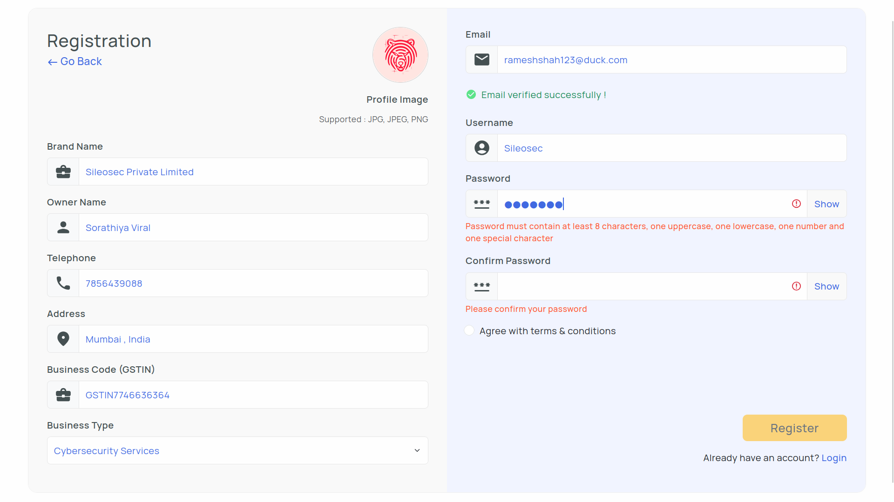
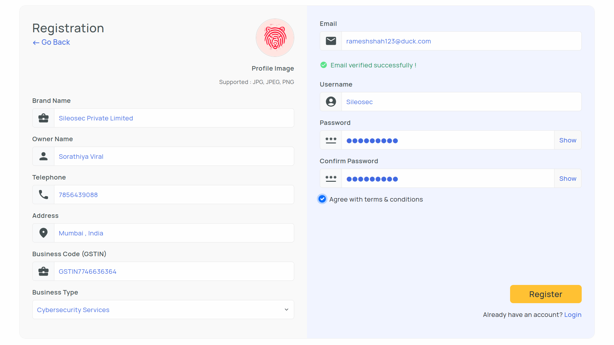
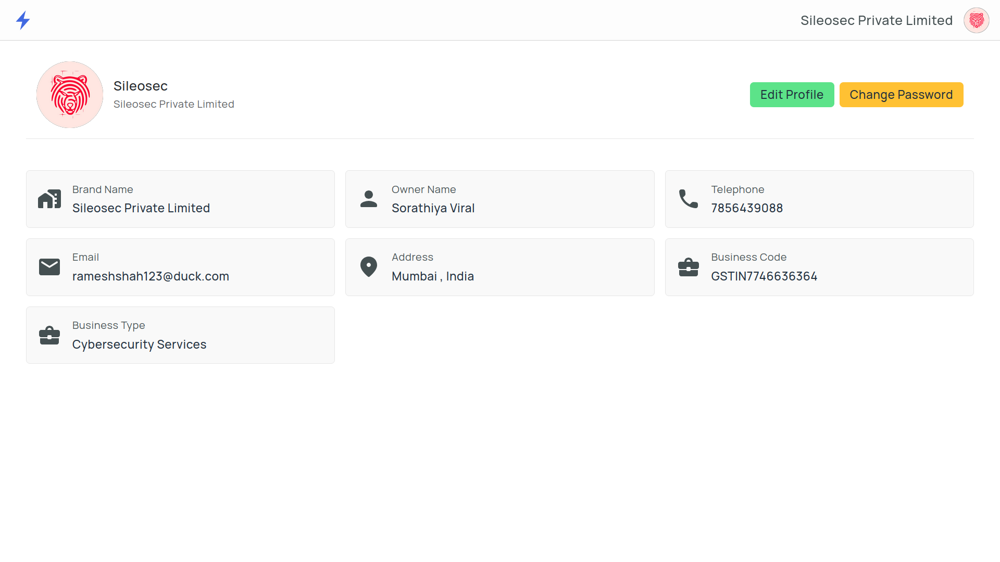
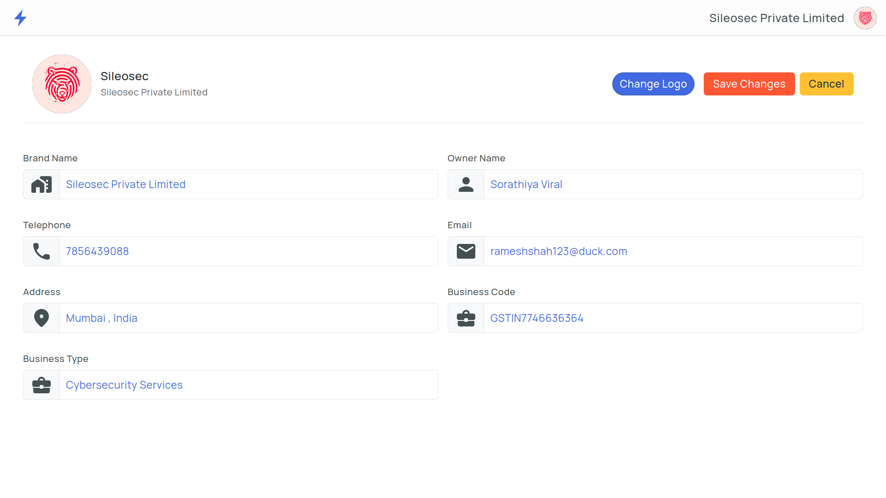
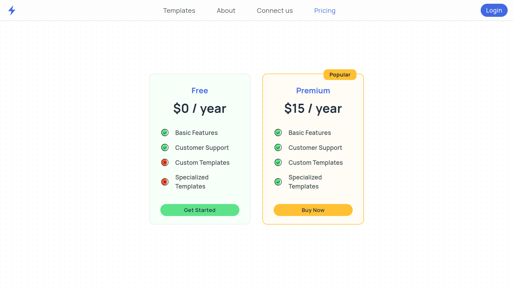
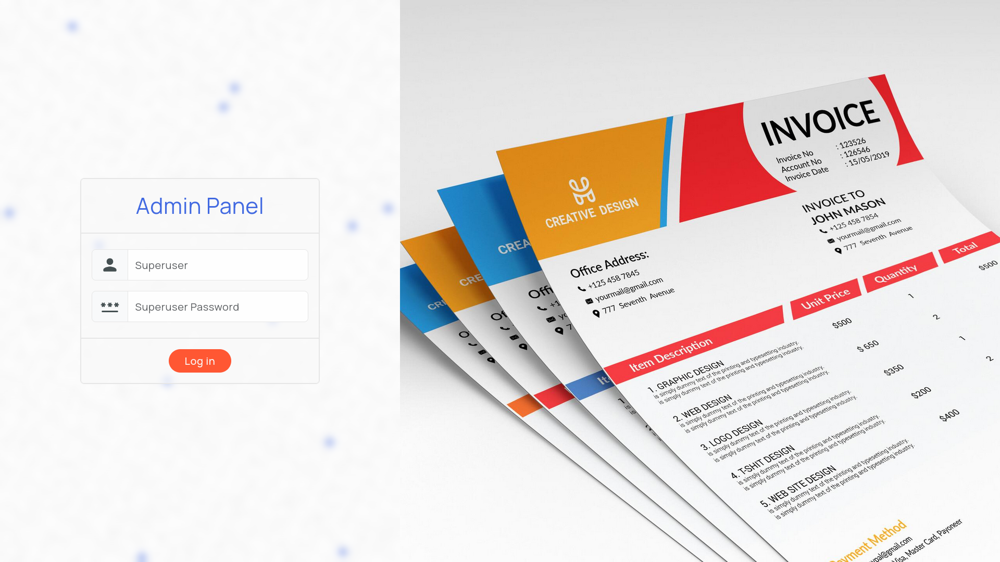
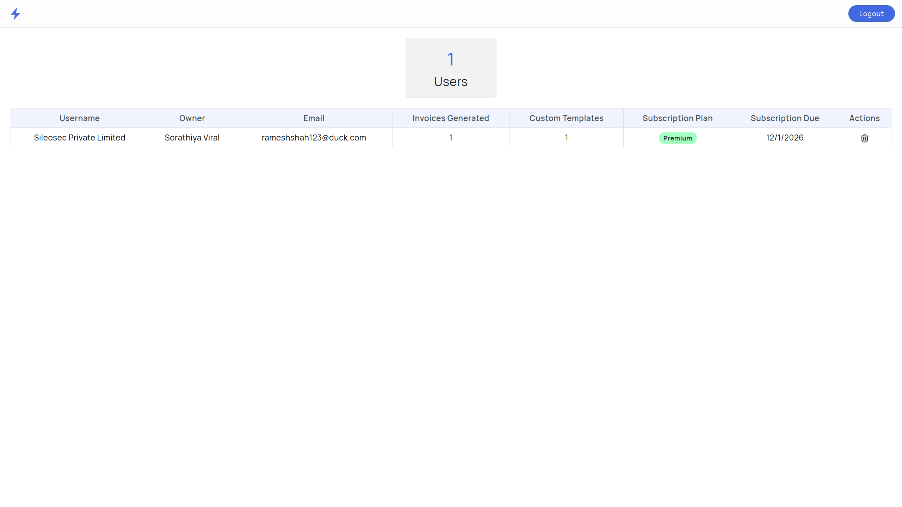

<div align="center">
  
  <h1>Quick Invoice</h1>
  <p><em>Streamline Your Invoicing Process with Ease</em></p>
</div>


---

## 📖 Brand Intro

Welcome to **Quick Invoice**, the ultimate full-stack web application designed to revolutionize invoice creation and management for vendors. Whether you're a freelancer, small business owner, or enterprise, Quick Invoice empowers you with a seamless, intuitive platform to generate professional invoices effortlessly. Experience the power of automation, customization, and efficiency — all in one place. Say goodbye to manual paperwork and hello to smart, scalable invoicing! 🚀


---

## ✨ Brand Features

Quick Invoice comes packed with powerful features to make invoicing a breeze:

- **👤 Vendor Accounts** – Secure registration and login to manage your invoices with personalized access.
- **🎨 Customizable Templates** – Choose from built-in professional layouts or design your own invoice templates.
- **📄 PDF Generation** – Generate high-quality PDFs using React-PDF, ready for download or direct email sharing.
- **📊 Interactive Dashboard** – Perform CRUD operations on invoices, search functionality, and template customization.
- **💳 Subscription Model** – Enjoy free basic customizations; unlock advanced features with a subscription.

---

## 🎥 Project Tour

Dive into Quick Invoice with our visual tour! Explore the application through screenshots and a demo video showcasing key features and user flows.

### 📹 Demo Video
<video width="100%" controls>
  <source src="Media/Quick_Tour.mp4" type="video/mp4">
  Your browser does not support the video tag.
</video>

### 🖼️ Screenshots

#### Landing Page
<div align="center">
  
</div>

#### About us Page
<div align="center">
  
</div>

#### Key Pages
<div align="center">
  
  
  
  
  
  
  
  
  
</div>


---

## 🔮 Future Features

We're continuously evolving Quick Invoice to meet your growing needs. Here's what's on the horizon :

- **📱 Mobile App** – Native iOS and Android apps for on-the-go invoicing.
- **🔗 API Integrations** – Connect with popular accounting software like QuickBooks and Xero.
- **🤖 AI-Powered Insights** – Automated invoice analysis and payment prediction using machine learning.
- **🌍 Multi-Currency Support** – Handle international transactions with ease.
- **📈 Advanced Analytics** – Detailed reports and dashboards for business intelligence.
- **🔐 Enhanced Security** – Two-factor authentication and blockchain-based verification and Secure OWASP Top-10 Flow
- **🎯 Custom Workflows** – Build tailored approval processes and automation rules.


---

## 🛠️ Tech Stack

Quick Invoice is built using cutting-edge technologies for optimal performance and scalability:

- **Frontend**: React.js ⚛️, Bootstrap 🎨, Vite ⚡
- **Backend**: Node.js 🟢, Express.js 🚂
- **Database**: MongoDB 🍃
- **PDF Engine**: React-PDF 📄
- **Authentication**: JWT 🔐
- **Payment Gateway**: Razorpay 💳
- **Email Service**: Nodemailer 📧
- **File Upload**: Multer 📎


---

## ⚙️ Installation & Setup

Get Quick Invoice up and running on your local machine in just a few steps!

### Prerequisites
- Node.js (v14 or higher) 🟢
- MongoDB (local or cloud instance) 🍃
- Git 🐙

### Clone the Repository
```bash
git clone https://github.com/Sorathiya-Viral/Quick-Invoice.git
cd Quick-Invoice
```

### Install Dependencies
```bash
# Root directory
npm install

# Backend
cd backend
npm install

# Frontend
cd ../frontend
npm install
```

### Environment Configuration
Create a `.env` file in the `backend` directory with the following variables:

```env

# MongoDB Connection
MONGODB_URI=mongodb://localhost:27017/Quick_Invoice

# JWT Secret
JWT_SECRET = your_super_secret_jwt_key_here

# Server Port
PORT = 5000
NODE_ENV = development

# Email Configuration
USE_EMAIL_SERVICE = true
EMAIL_USER = your_email@example.com
EMAIL_PASS = your_gmail_app_password

# Razorpay
RAZORPAY_KEY_ID = your_razorpay_key_id
RAZORPAY_KEY_SECRET = your_razorpay_key_secret

# Temprary Admin Subscription ID
ADMIN_SUBSCRIPTION_KEY=admsub_razoralt@2026

ADMIN_USERNAME = admin
ADMIN_PASSWORD = admin@123
ADMIN_EMAIL = admin_email_id

# ADMIN_LOGIN_PAGE Available at `http://localhost:5173/admin/login`

```

> **Note**: Replace the placeholder values with your actual credentials. For production, use environment-specific secrets.

### Run the Application
```bash
# From root directory
npm start          # Run full stack (backend + frontend)
npm run server     # Run backend only
npm run client     # Run frontend only
```

The application will be available at:
- Frontend + Backend : `http://localhost:5173` 🌐
- Backend API : `http://localhost:5000` 🔧


---

<div align="center">
  <p>Made with ❤️ by the Quick Invoice Team</p>
  <p>⭐ Star us on GitHub if you find this project helpful!</p>
</div>